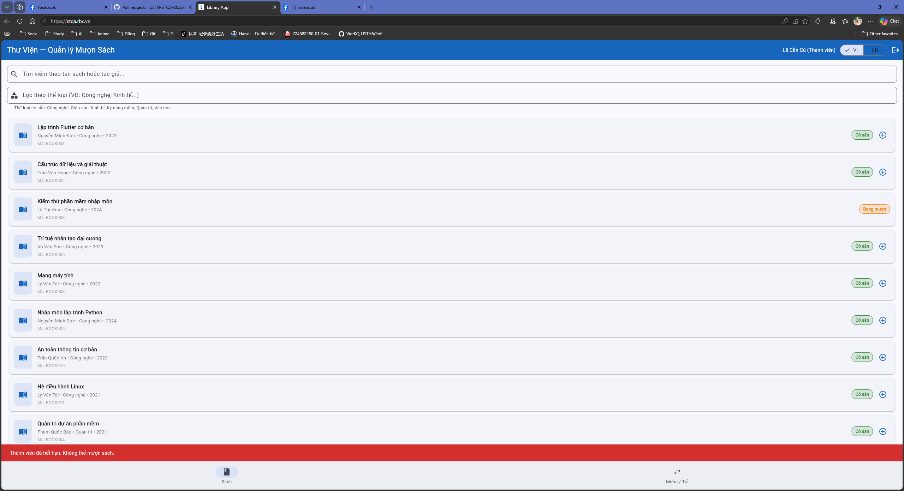
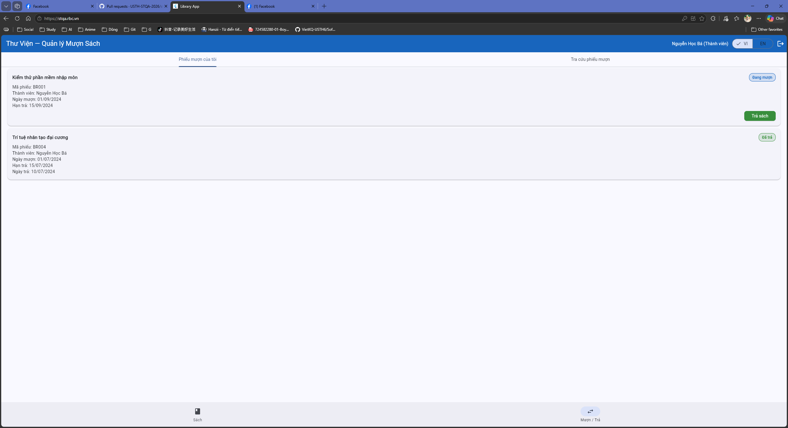

# Bug Reports

> **Instructions**: Create 1 bug entry for each TC with a **Fail** result.
> See [examples/sample-bug-report.md](../examples/sample-bug-report.md) to understand how to write good bug reports.
> Each bug needs: descriptive title, steps to reproduce, expected vs actual results, severity + justification.

| Info | |
|---|---|
| **Group** | `Group 20` |
| **Date Reported** | `25/05/2026` |

---

## BUG-01

| Attribute | Details |
|-----------|---------|
| **Bug ID** | BUG-01 |
| **Related TC** | `TC- (Librarian's Book Borrowing Process)` |
| **Related REQ** | `REQ-04 & Overview` |
| **Severity** | `Medium` |
| **Reporter** | `Đỗ Minh Tấn` |
| **Date Discovered** | `25/05/2026` |
| **Status** | `Open` |

**Title:**
Librarian cannot borrow books for members (missing borrow feature on the Librarian's interface).

**Environment:**
- Browser: Chrome 148.0.7778.168
- Operating System: Windows
- Interface Language: Tiếng Việt

**Preconditions:**
Logged in as Librarian (`librarian@library.com`), system data in its initial state (seed data).

**Steps to Reproduce:**
1. Access the website https://stqa.rbc.vn and log in with account: `librarian@library.com` / `admin123`.
2. Observe the **Sách** tab: There is no borrow button (icon **+**) next to any book with "Có sẵn" status.
3. Switch to the **Mượn / Trả** tab:
   - Only displays a search list of loans and the **Trả sách** button for active loans.
   - Completely lacks any button, icon, or input form for the Librarian to start creating a new borrow transaction for a specific Member ID.

**Expected Result:**
According to the business specifications in the **SRS - Section 1 (System Overview)**, the Librarian has the authority to **"mượn/trả sách cho thành viên"**. The system must display a borrowing option/button or allow the Librarian to input a Member ID to create a new borrow record for that member.

**Actual Result:**
The Librarian's interface completely lacks the feature or button to borrow books for a member. The Librarian can only process book returns for pre-existing active loans.

**Impact:**
Librarians cannot assist members in borrowing books when requested directly at the counter, which severely violates the core business requirements described in Section 1 of the SRS.

---

## BUG-02

| Attribute | Details |
|-----------|---------|
| **Bug ID** | BUG-02 |
| **Related TC** | `TC-17` |
| **Related REQ** | `REQ-04` |
| **Severity** | `High` |
| **Reporter** | `Đỗ Minh Tấn` |
| **Date Discovered** | `25/05/2026` |
| **Status** | `Open` |

**Title:**
System allows members to borrow a 4th book, exceeding the maximum limit (3 books) defined in REQ-04.

**Environment:**
- Browser: Chrome 148.0.7778.168
- Operating System: Windows
- Interface Language: Tiếng Việt

**Preconditions:**
The Member account is already borrowing exactly 3 books (e.g., `ba.nguyen@email.com` is borrowing BOOK001, BOOK002, and BOOK004).

**Steps to Reproduce:**
1. Log in with the member account holding 3 books (`ba.nguyen@email.com` / `password123`).
2. On the **Sách** tab, locate a book in "Có sẵn" status (e.g., `BOOK005 - Trí tuệ nhân tạo đại cương`).
3. Click the borrow button (**+**) next to BOOK005.
4. The borrow confirmation dialog appears; click **Mượn**.

**Expected Result:**
The system rejects the borrow request and displays a suitable error message: "Đã đạt giới hạn mượn tối đa (3 sách)." The book BOOK005 remains in "Có sẵn" status and no new borrow record is created.

**Actual Result:**
The borrowing succeeds. The notification "Book borrowed successfully!" is displayed, BOOK005's status changes to "Đang mượn", and the system automatically creates a 4th active loan record in the Borrow/Return tab.

**Impact:**
Severely violates the core business rule limiting members to a maximum of 3 books. Members can borrow an unlimited number of books as long as they are available in the library.

---

## BUG-04

| Attribute | Details |
|-----------|---------|
| **Bug ID** | BUG-04 |
| **Related TC** | `TC-15` |
| **Related REQ** | `REQ-04` |
| **Severity** | `Medium` |
| **Reporter** | `Đỗ Minh Tấn` |
| **Date Discovered** | `25/05/2026` |
| **Status** | `Open` |

**Title:**
System displays incorrect error message when a "Suspended" Member attempts to borrow a book (displays account expired message instead of suspended message).

**Environment:**
- Browser: Chrome 148.0.7778.168
- Operating System: Windows
- Interface Language: Tiếng Việt

**Preconditions:**
Use a suspended Member account (`cu.le@email.com` / `password123`).

**Steps to Reproduce:**
1. Log in with account `cu.le@email.com` / `password123`.
2. On the **Sách** tab, locate an available book (e.g., `BOOK001`).
3. Click the borrow button (**+**), then click **Mượn** on the confirmation dialog.

**Expected Result:**
The borrow request is rejected with the correct error message: "Thành viên đang bị tạm ngưng. Không thể mượn sách."

**Actual Result:**
The interface displays a rejection message but with the content: **"Thành viên đã hết hạn. Không thể mượn sách."**

**Impact:**
Violates the requirement to state the exact reason for borrow rejection in the REQ-04 specification. Causes confusion to users as suspended members might mistake their account status for being expired.

---

## BUG-03

| Attribute | Details |
|-----------|---------|
| **Bug ID** | BUG-03 |
| **Related TC** | `TC-19` |
| **Related REQ** | `REQ-05` |
| **Severity** | `Medium` |
| **Reporter** | `Đỗ Minh Tấn` |
| **Date Discovered** | `25/05/2026` |
| **Status** | `Open` |

**Title:**
Overdue book is returned successfully but the system fails to display any overdue warning as specified in REQ-05.

**Environment:**
- Browser: Chrome 148.0.7778.168
- Operating System: Windows
- Interface Language: Tiếng Việt

**Preconditions:**
Logged in with member account `ba.nguyen@email.com` / `password123`. The account currently has an active overdue loan record `BR001` (Due Date: 15/09/2024).

**Steps to Reproduce:**
1. Log in with account `ba.nguyen@email.com` / `password123`.
2. Switch to the **Mượn / Trả** tab.
3. Under "Phiếu mượn của tôi", locate loan record `BR001` (Book: *Kiểm thử phần mềm nhập môn*, Hạn trả: `15/09/2024`).
4. Click the green **Trả sách** button next to the loan record.

**Expected Result:**
The book is returned successfully. The system must display a clear overdue warning alert (e.g., cảnh báo sách quá hạn or number of overdue days) as specified in REQ-05.

**Actual Result:**
The book is returned successfully and its status updates to "Đã trả", but the system **completely fails to display any overdue warning or alert** on the screen.

**Impact:**
Directly violates the core business requirement in REQ-05 (Book Return). The system cannot remind or notify members/librarians about overdue borrowing behavior.

---

## BUG-05

| Attribute | Details |
|-----------|---------|
| **Bug ID** | BUG-05 |
| **Related TC** | `TC-27` |
| **Related REQ** | `REQ-03` |
| **Severity** | `High` |
| **Reporter** | `Dương Minh Đức` |
| **Date Discovered** | `30/05/2026` |
| **Status** | `Open` |

**Title:**
Search results are not combined correctly with the Genre filter (Genre filter overrides Search keyword).

**Environment:**
- Browser: Chrome 148
- Operating System: Windows
- Interface Language: English

**Preconditions:**
Logged in as a Member account, on the **Books** tab.

**Steps to Reproduce:**
1. Type a keyword in the Search bar that belongs to a specific genre (e.g., "Flutter", which is in "Technology").
2. Enter a different, non-matching genre in the Filter bar (e.g., "Economy").
3. Observe the displayed book list.

**Expected Result:**
The system should show **"No books found"** because no book in the "Economy" genre has the word "Flutter" in its title. The search and filter should act as an "AND" condition.

**Actual Result:**
The system displays all books of the "Economy" genre, completely ignoring the "Flutter" keyword in the search bar.

**Impact:**
Filtering logic is incorrect. Users cannot narrow down search results using genres, making it impossible to find specific books in large categories.

---

<!-- Copy the BUG template above to add BUG-07, BUG-08, ... for each failed TC -->
