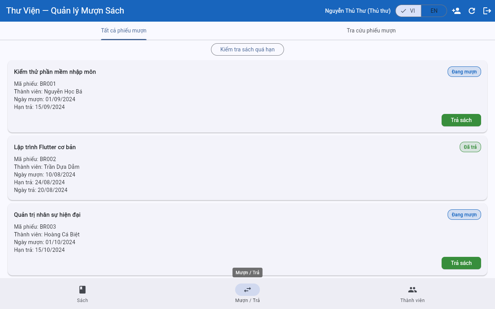
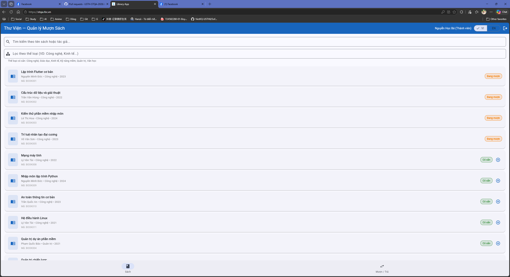
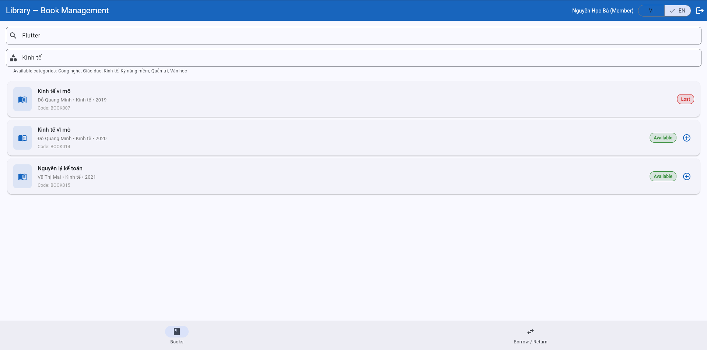
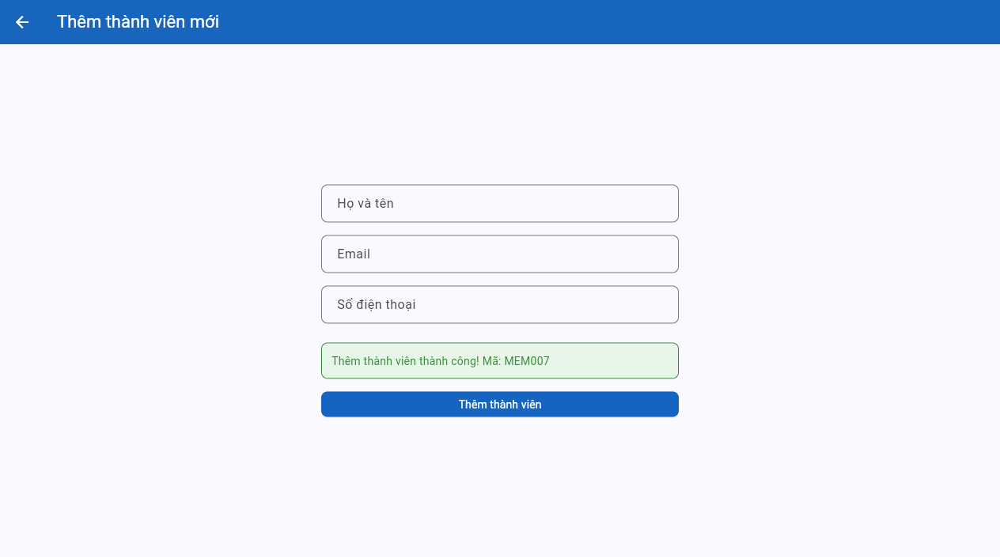
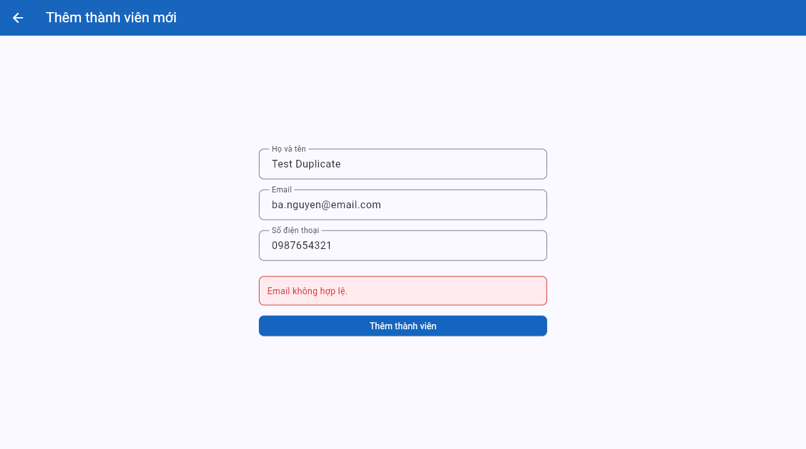
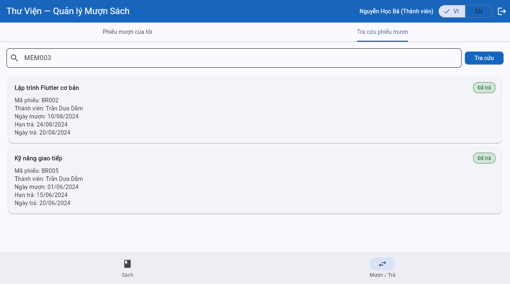

# Bug Reports

> **Instructions**: Create 1 bug entry for each TC with a **Fail** result.
> See [examples/sample-bug-report.md](../examples/sample-bug-report.md) to understand how to write good bug reports.
> Each bug needs: descriptive title, steps to reproduce, expected vs actual results, severity + justification.

| Info | |
|---|---|
| **Group** | `Group 20` |
| **Date Reported** | `25/05/2026` |

## Test Environment

| Field | Value |
|-------|-------|
| **Browser** | Chrome 148.0.7778.168 |
| **Operating System** | Windows |
| **Interface Language** | Tiếng Việt |

---

## BUG-01

| Attribute | Details |
|-----------|---------|
| **Bug ID** | BUG-01 |
| **Related TC** | Exploratory — SRS §1 (role: Thủ thư) / REQ-04 |
| **Related REQ** | `REQ-04 & SRS §1 (System Overview)` |
| **Severity** | `Medium` |
| **Reporter** | `Đỗ Minh Tấn` |
| **Date Discovered** | `25/05/2026` |
| **Status** | `Open` |

**Title:**
Librarian cannot borrow books for members (missing borrow feature on the Librarian's interface).

**Preconditions:**
Logged in as Librarian (`librarian@library.com`), system data in its initial state (seed data).

**Steps to Reproduce:**
1. Access the website https://stqa.rbc.vn and log in with account: `librarian@library.com` / `admin123`.
2. Observe the **Sách** tab: There is no borrow button (icon **+**) next to any book with "Có sẵn" status.
3. Switch to the **Mượn / Trả** tab:
   - Only displays a search list of loans and the **Trả sách** button for active loans.
   - Completely lacks any button, icon, or input form for the Librarian to start creating a new borrow transaction for a specific Member ID.

**Expected Result:**
According to the business specifications in the **SRS — Section 1 (System Overview)**, the Librarian role is defined to **"mượn/trả sách cho thành viên"** (borrow/return books on behalf of members). The system must display a borrowing option/button or allow the Librarian to input a Member ID to create a new borrow record for that member.

**Actual Result:**
The Librarian's interface completely lacks the feature or button to borrow books for a member. The Librarian can only process book returns for pre-existing active loans.

**Impact:**
Librarians cannot assist members in borrowing books when requested directly at the counter, which severely violates the core business requirements described in Section 1 of the SRS.

> **Note:** This defect was found during **exploratory testing** of the Librarian's Mượn / Trả interface rather than from a scripted test case; it traces to the role definition in SRS §1.

**Proposed Solution:**
Extend the Librarian's interface with a "Mượn sách cho thành viên" feature — a form in the **Mượn / Trả** tab where the Librarian inputs a Member ID and selects an available book to create a borrow record on behalf of that member.

---

## BUG-02

| Attribute | Details |
|-----------|---------|
| **Bug ID** | BUG-02 |
| **Related TC** | `TC-23` |
| **Related REQ** | `REQ-04` |
| **Severity** | `High` |
| **Reporter** | `Đỗ Minh Tấn` |
| **Date Discovered** | `25/05/2026` |
| **Status** | `Open` |

**Title:**
System allows members to borrow a 4th book, exceeding the maximum limit (3 books) defined in REQ-04.

**Preconditions:**
The Member account is already borrowing exactly 3 books (e.g., `ba.nguyen@email.com` is borrowing BOOK001, BOOK002, and BOOK004).

**Steps to Reproduce:**
1. Log in with the member account holding 3 books (`ba.nguyen@email.com` / `password123`).
2. On the **Sách** tab, locate a book in "Có sẵn" status (e.g., `BOOK005 - Trí tuệ nhân tạo đại cương`).
3. Click the borrow button (**+**) next to BOOK005.
4. The borrow confirmation dialog appears; click **Mượn**.

**Expected Result:**
The system rejects the borrow request and displays a suitable error message: "Đã đạt giới hạn mượn tối đa (3 sách)." The book BOOK005 remains in "Có sẵn" status and no new borrow record is created.

**Actual Result:**
The borrowing succeeds. The notification "Book borrowed successfully!" is displayed, BOOK005's status changes to "Đang mượn", and the system automatically creates a 4th active loan record in the Borrow/Return tab.

**Impact:**
Severely violates the core business rule limiting members to a maximum of 3 books. Members can borrow an unlimited number of books as long as they are available in the library.

**Proposed Solution:**
Before confirming any borrow request, the system must validate that the requesting member's current active loan count is below the maximum of 3. If the count is already at 3, the request must be rejected immediately with the appropriate error message and no record should be created.

---

## BUG-03

| Attribute | Details |
|-----------|---------|
| **Bug ID** | BUG-03 |
| **Related TC** | `TC-25` |
| **Related REQ** | `REQ-05` |
| **Severity** | `Medium` |
| **Reporter** | `Đỗ Minh Tấn` |
| **Date Discovered** | `25/05/2026` |
| **Status** | `Open` |

**Title:**
Overdue book is returned successfully but the system fails to display any overdue warning as specified in REQ-05.

**Preconditions:**
Logged in with member account `ba.nguyen@email.com` / `password123`. The account currently has an active overdue loan record `BR001` (Due Date: 15/09/2024).

**Steps to Reproduce:**
1. Log in with account `ba.nguyen@email.com` / `password123`.
2. Switch to the **Mượn / Trả** tab.
3. Under "Phiếu mượn của tôi", locate loan record `BR001` (Book: *Kiểm thử phần mềm nhập môn*, Hạn trả: `15/09/2024`).
4. Click the green **Trả sách** button next to the loan record.

**Expected Result:**
The book is returned successfully. The system must display a clear overdue warning alert (e.g., cảnh báo sách quá hạn or number of overdue days) as specified in REQ-05.

**Actual Result:**
The book is returned successfully and its status updates to "Đã trả", but the system **completely fails to display any overdue warning or alert** on the screen.

**Impact:**
Directly violates the core business requirement in REQ-05 (Book Return). The system cannot remind or notify members/librarians about overdue borrowing behavior.

**Proposed Solution:**
When a return is processed, the system must compare the return date against the due date. If the return is late, a warning notification showing the number of overdue days must be displayed before or immediately after confirming the return, as required by REQ-05.

---

## BUG-04

| Attribute | Details |
|-----------|---------|
| **Bug ID** | BUG-04 |
| **Related TC** | `TC-21` |
| **Related REQ** | `REQ-04` |
| **Severity** | `Medium` |
| **Reporter** | `Đỗ Minh Tấn` |
| **Date Discovered** | `25/05/2026` |
| **Status** | `Open` |

**Title:**
System displays incorrect error message when a "Suspended" Member attempts to borrow a book (displays account expired message instead of suspended message).

**Preconditions:**
Use a suspended Member account (`cu.le@email.com` / `password123`).

**Steps to Reproduce:**
1. Log in with account `cu.le@email.com` / `password123`.
2. On the **Sách** tab, locate an available book (e.g., `BOOK001`).
3. Click the borrow button (**+**), then click **Mượn** on the confirmation dialog.

**Expected Result:**
The borrow request is rejected with the correct error message: "Thành viên đang bị tạm ngưng. Không thể mượn sách."

**Actual Result:**
The interface displays a rejection message but with the content: **"Thành viên đã hết hạn. Không thể mượn sách."**

**Impact:**
Violates the requirement to state the exact reason for borrow rejection in the REQ-04 specification. Causes confusion to users as suspended members might mistake their account status for being expired.

**Proposed Solution:**
The system should maintain distinct error messages for each member account status. When a borrow is blocked due to a **suspended** account, the message must explicitly state "Tạm ngưng"; when blocked due to an **expired** account, it must state "Hết hạn". The two states must not be conflated.

---

## BUG-05

| Attribute | Details |
|-----------|---------|
| **Bug ID** | BUG-05 |
| **Related TC** | `TC-17` |
| **Related REQ** | `REQ-03` |
| **Severity** | `High` |
| **Reporter** | `Dương Minh Đức` |
| **Date Discovered** | `30/05/2026` |
| **Status** | `Open` |

**Title:**
Search results are not combined correctly with the Genre filter (Genre filter overrides Search keyword).

> **Environment deviation:** Interface Language: English (differs from global default).

**Preconditions:**
Logged in as a Member account, on the **Books** tab.

**Steps to Reproduce:**
1. Type a keyword in the Search bar that belongs to a specific genre (e.g., "Flutter", which is in "Technology").
2. Enter a different, non-matching genre in the Filter bar (e.g., "Economy").
3. Observe the displayed book list.

**Expected Result:**
The system should show **"No books found"** because no book in the "Economy" genre has the word "Flutter" in its title. The search and filter should act as an "AND" condition.

**Actual Result:**
The system displays all books of the "Economy" genre, completely ignoring the "Flutter" keyword in the search bar.

**Impact:**
Filtering logic is incorrect. Users cannot narrow down search results using genres, making it impossible to find specific books in large categories.

**Proposed Solution:**
The book search must apply both the keyword and the genre filter simultaneously as an AND condition — the result list should only contain books whose title/author matches the keyword AND whose genre matches the selected filter. The genre filter must not independently override the keyword search.

---

## BUG-06

| Attribute | Details |
|-----------|---------|
| **Bug ID** | BUG-06 |
| **Related TC** | `TC-29` |
| **Related REQ** | `REQ-07` |
| **Severity** | `High` |
| **Reporter** | `Nguyễn Đinh Phú Vinh` |
| **Date Discovered** | `01/06/2026` |
| **Status** | `Open` |

**Title:**
System allows creating a new member with an invalid email address format (missing dot in the domain part), violating REQ-07.

**Preconditions:**
Logged in as Librarian (`librarian@library.com`), currently on the **Members** tab.

**Steps to Reproduce:**
1. Access the website https://stqa.rbc.vn and log in with account: `librarian@library.com` / `admin123`.
2. Click the tab **Thành viên** (Members).
3. Click the **+** (Add Member) button on the top AppBar.
4. Input details: Name: `Test Name One`, Email: `testemail@domain` (note there is no `.` in the domain), Phone: `0987654321`.
5. Click **Thêm thành viên**.

**Expected Result:**
The system should validate the email syntax, reject the creation, and display an error message: "Email không hợp lệ."

**Actual Result:**
The creation succeeded and the system displayed the success message: "Thêm thành viên thành công! Mã: MEM007".

**Impact:**
Violates the requirement in REQ-07 to reject emails that do not contain a dot in the domain part. Invalid emails will lead to database corruption and communication failures with library members.

**Proposed Solution:**
Email validation on the Add Member form must enforce that the domain portion contains at least one dot (e.g., `user@domain.com` is valid; `user@domain` is not). Any submission failing this check must be rejected before the record is created.

---

## BUG-07

| Attribute | Details |
|-----------|---------|
| **Bug ID** | BUG-07 |
| **Related TC** | `TC-30` |
| **Related REQ** | `REQ-07` |
| **Severity** | `Medium` |
| **Reporter** | `Nguyễn Đinh Phú Vinh` |
| **Date Discovered** | `01/06/2026` |
| **Status** | `Open` |

**Title:**
System displays incorrect generic error message "Email không hợp lệ." when attempting to register a duplicate email, instead of indicating the email already exists, violating REQ-07.

**Preconditions:**
Logged in as Librarian (`librarian@library.com`), currently on the **Members** tab.

**Steps to Reproduce:**
1. Access the website https://stqa.rbc.vn and log in with account: `librarian@library.com` / `admin123`.
2. Click the tab **Thành viên** (Members).
3. Click the **+** (Add Member) button on the top AppBar.
4. Input details: Name: `Test Duplicate`, Email: `ba.nguyen@email.com` (which is already assigned to member Nguyễn Học Bá MEM002), Phone: `0987654321`.
5. Click **Thêm thành viên**.

**Expected Result:**
The creation is rejected with a specific error message stating that the email already exists (e.g. "Email đã tồn tại.").

**Actual Result:**
The creation is rejected, but the system displays the incorrect generic error message: "Email không hợp lệ." (Invalid email).

**Impact:**
Misleading error feedback. Users might think they made a syntax error in the email rather than knowing the email is already in use by another member, which degrades the user experience and violates REQ-07 specification.

**Proposed Solution:**
The system should produce two distinct error responses for email input failures: "Email không hợp lệ." for a syntactically invalid format, and a separate message such as "Email đã tồn tại trong hệ thống." for a duplicate conflict. The format-error message must not be reused for the duplicate case.

---

## BUG-08

| Attribute | Details |
|-----------|---------|
| **Bug ID** | BUG-08 |
| **Related TC** | `TC-34` |
| **Related REQ** | `REQ-08` |
| **Severity** | `High` |
| **Reporter** | `Nguyễn Đinh Phú Vinh` |
| **Date Discovered** | `01/06/2026` |
| **Status** | `Open` |

**Title:**
Member role can look up and view borrow records of other members, causing a critical data privacy leak, violating REQ-08.

**Preconditions:**
Logged in as a Member account (e.g. `ba.nguyen@email.com` / `password123` - MEM002).

**Steps to Reproduce:**
1. Log in to https://stqa.rbc.vn with Member credentials: `ba.nguyen@email.com` / `password123`.
2. Click the tab **Mượn / Trả** (Borrow/Return).
3. Click the inner tab **Tra cứu phiếu mượn** (Borrow record lookup).
4. Enter another member's ID (e.g., `MEM003` which belongs to Trần Dựa Dẫm) in the search bar.
5. Click the **Tra cứu** button.

**Expected Result:**
Access is denied or search returns no results, because members must only be allowed to view their own borrow records and are strictly prohibited from viewing other members' records as defined in REQ-08.

**Actual Result:**
The search successfully retrieves and displays the borrow records of Trần Dựa Dẫm (MEM003).

**Impact:**
Critical security and privacy violation. Any registered member can spy on the borrowing habits and records of all other members in the library just by knowing or guessing their member IDs.

**Proposed Solution:**
The borrow record lookup for the Member role must enforce ownership-based access control — the system should automatically scope all lookup results to the currently authenticated member's own records, regardless of the Member ID entered in the search field. Any query for another member's ID must return no results or show an access-denied message.

---
